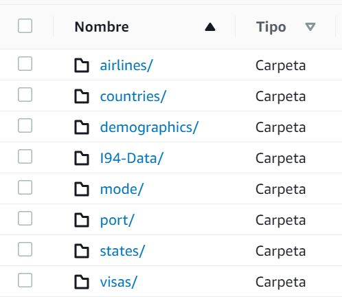
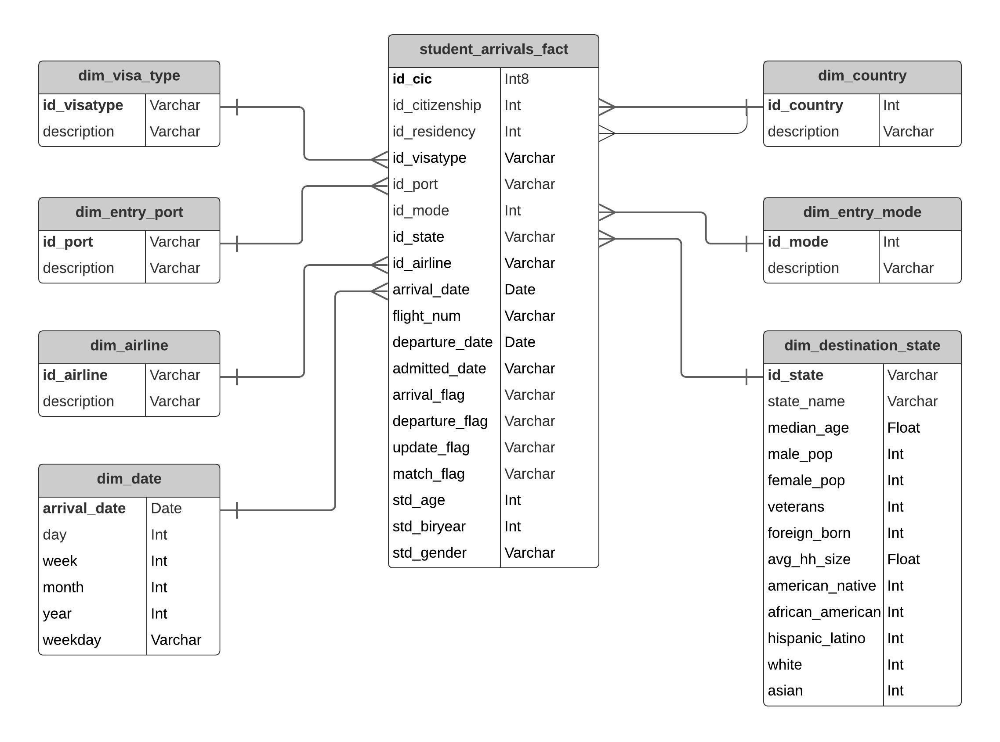
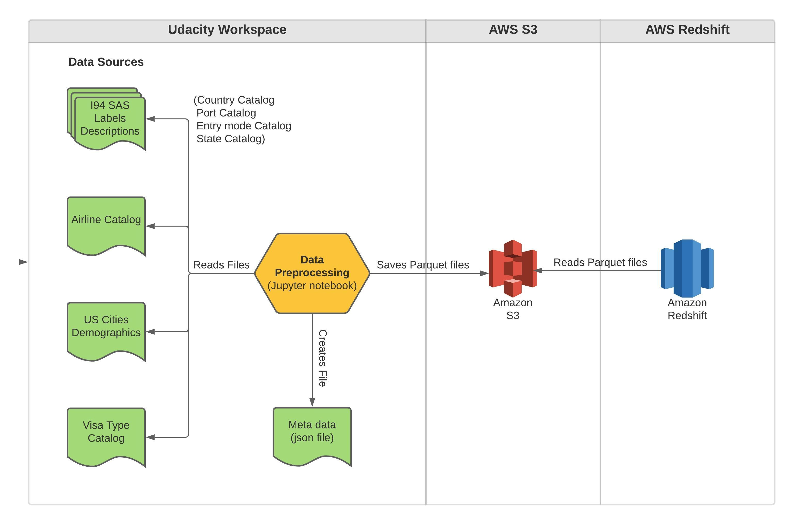

# Student Arrivals Data Model
### Data Engineering Capstone Project

#### Project Summary
I choose to work with the Udacity provided project, hence I select the immigration and US cities demographics datasets as well as along with 2 additional ones: Airlines and Visa types. The objective is to build a dimensional model in Amazon Redshift in order to analyze the data of immigrants with student visas and fill it with an ETL process.

The project follows the following steps:
* Step 1: Project Scope and data gathering
* Step 2: Exploring, Assessing and saving the Data
* Step 3: Defining the Data Model
* Step 4: Running the ETL
* Step 5: Project Write Up

### Step 1: Project Scope and data gathering

#### 1.1 Scope
For this project, two of the four datasets provided are used: *I94 Immigration Data* and *U.S. City Demographic Data*, also two extra datasets: *iataCodes.xlsx* and *visaType.csv*.

A subset of the immigration data is used - student visa records only(I94VISA = 3). The end solution is a dimensional model built in Redshift to analyze and make reports about student data. For instance, discovering insights about student US State preference, student nationalities that visit the country the most, student arrivals per month, etc.

The datasets are preprocessed using Spark and Pandas in the Udacity Workspace with a Jupyter notebook and then saved to S3 in parquet files, then with an ETL process written in python, the staging, dimension and fact tables are created in Redshift and filled with the data stored in S3.

#### 1.2 Data Sources description 

- **I94 Immigration Data**: This data comes from the US National Tourism and Trade Office. [source](https://travel.trade.gov/research/reports/i94/historical/2016.html).
Contains international visitor arrival statistics by world regions and select countries, type of visa, mode of transportation, age groups, states visited (first intended address only), and the top ports of entry (for select countries), etc.
- **U.S. City Demographic Data**: This data comes from OpenSoft. [source](https://public.opendatasoft.com/explore/dataset/us-cities-demographics/export/).
Contains information about the demographics of all US cities and census-designated places with a population greater or equal to 65,000. This data comes from the US Census Bureau's 2015 American Community Survey.
- **iataCodes.xlsx**: This data was gathered from a few sources:
[source1](https://www.iata.org/en/publications/directories/code-search/),
[source2](https://azcargo.cz/en/services/support/iata-airline-codes/)
[source3](https://en.wikipedia.org/wiki/List_of_airline_codes)
Contains the Airline codes and Airline names.
- **visaType.csv**: This data comes from the US National Tourism and Trade Office.
[source](https://www.trade.gov/i-94-arrivals-program)
Contains the Visa codes and Visa descriptions.  
- **I94_SAS_Labels_Descriptions.SAS**: This data was provided by Udacity.
Contains a short description for each column of the I94 Immigration Dataset. *State, Country, Entry mode and Port catalogs* are extracted from this file.

### Step 2: Exploring, Assessing and saving the Data
#### 2.1 Exploring the Data 
Data is explored and cleaned using data wrangling functions and methods like `printSchema()`, `isNull()`, `isnan()`, `groupby()`, `filter()`, `count()`, etc.

#### 2.2 Cleaning Steps

For I94 Immigration Data:
- Checking duplicates: duplicated records were deleted (cicid must be unique).
- Checking missing values: missing vales were replaced by default values (-1:no data, 99: all other values, 0, or '').
- Casting: several fields were casted from Double to Integer
- Checking non existing codes: codes that don't exist in the Catalogs were replaced by default values.

For us-cities-demographics:
- Was pivoted to have ethnicity data in columns.
- Was aggregated by State.

#### 2.3 Saving data to S3 in parquet files

            

### Step 3: Defining the Data Model
#### 3.1 Conceptual Data Model
I chose a dimensional model in Redshift because I'm working with structured and relatively small amount of data(1.3 Millon rows). If data grows, It will not be a problem since a Redshift cluster is scalable, distributed, powerful and cost-effective. The datasets structures adapt naturally to a dimensional model.

The Data Model has one fact table and 7 dimensional tables.

1- Fact table - **student_arrivals_fact**: is filled with the *i94 immigration data*.

2- Dimensional tables:
- **dim_visa_type**: is filled with the *visaType.csv* dataset.
- **dim_entry_port**: is filled with the data extracted from *I94_SAS_Labels_Descriptions.SAS*.
- **dim_airline**: is filled with the *iataCodes.xlsx* dataset.
- **dim_date**: is filled with the arrival_date field of *student_arrivals_fact* table.
- **dim_country**: is filled with the data extracted from *I94_SAS_Labels_Descriptions.SAS*.
- **dim_entry_mode**: is filled with the data extracted from *I94_SAS_Labels_Descriptions.SAS*.
- **dim_destination_state**: is filled with the data extracted from *I94_SAS_Labels_Descriptions.SAS* and *us-cities-demographics.csv*.

#### 3.2 Mapping Out Data Pipelines
Steps necessary to pipeline the data into The Data Model:

* Create the staging, dimensional and fact tables.(if model doesn't exist)
* Truncate dimensional tables.(except dim_date)
* Copy data from S3 to staging tables and to some dimensional tables.
* Insert data from the staging tables to the rest dimensional tables.
* Insert data from the staging tables to the fact table.

**Data Model**

**Data Flow**

### Step 4: Running the ETL
#### 4.1 Creating the Data Model

* **Creating a Redshift Cluster(Optional)**
`!python ./src/create_redshift_cluster.py create`
* **Creating tables: Staging, Facts and Dimensions (First time only)**
`!python ./src/create_tables.py`
* **Extracting from S3, Transforming and Loading to Fact and Dimension tables in Redshift**
`!python ./src/etl.py`
* **Deleting a Redshift Cluster(Optional)**
`!python ./src/create_redshift_cluster.py delete`

#### 4.2 Data Quality Checks
Two quality checks are done:

1- Counting records: The *medata.json* file is read, it contains the expected rows per table. The test compares the expected rows with the number of rows of each table.

2- Identifying records with null or empty values in description column for dimensional tables.

`!python ./src/data_quality.py`

#### 4.3 Data dictionary 
see the file: **data dictionary.xlsx**

### Step 5: Project Write Up
#### 5.1 Clearly state the rationale for the choice of tools and technologies for the project.

I preprocessed the data "locally" in the Workspace since it was possible to do it. The amount of data processed is relatively small; thus, it was not neccessary to do it on the cloud. I processed the I94 immigration data using Spark because it is the largest dataset. It took half the time than in Pandas since Spark works with parallelism and partitions. I processed the rest of the data with Pandas. Finally, I saved all data in S3 to be easily consumed by Redshift.

I chose Redshift for it is scalable, distributed, conventional (it uses SQL and relational DB), powerful and cost-effective, and because the datasets structures naturally adapt to a dimensional model. Redshift can be easily maintained, since no advanced or specialized knowledge is required to do so.

#### 5.2 Propose how often the data should be updated and why.

For the stated purpose of the model, I believe the data could be updated weekly given its analytical and non-operational nature.

#### 5.3 Write a description of how you would approach the problem differently under the following scenarios:
 * **The data was increased by 100x.**: I would have preprocessed the data on the cloud since it would be difficult to do it on-premises, a powerful hardware would be required. I've always would have used S3 and Redshift, they can easily adapt to data grow.
 * **The data populates a dashboard that must be updated on a daily basis by 7am every day.**: 
  I would have used a tool like Apache Airflow to schedule and run the data pipelines. 
 * **The database needed to be accessed by 100+ people.**: In Redshift Cluster, Node type and the number of nodes can be adjusted as needed to handle the user demand.

# Project files

1. **aws/credentials.cfg** - contains all the information and credentials to access to S3 and Redshif Cluster.
2. **data sources:**
   - data/iataCodes.xlsx
   - data/us-cities-demographics.csv
   - data/vitaType.csv
3. **source files:** 
   - **src/create_redshift_cluster.py** - creates and deletes a redshift cluster according to the credentials.cfg file.
   - **src/create_tables.py** - drops and creates the fact and dimension tables for the star schema in Redshift.
   - **src/data_quality.py** - run quality checks.
   - **src/etl.py** - is where data from S3 is loaded into staging tables on Redshift and then process that data into the analytics tables on Redshift.
   - **src/sql_queries.py** - is where all the SQL statements are defined.
4. **Capstone Project Steps.ipynb** - contains all the steps and details to run the project.
5. **I94_SAS_Labels_Descriptions.SAS** - contains a short description for each column of the I94 Immigration Dataset
6. **metadata.json** - contains the expected rows per table and the description column for each dimension.
7. **data dictionary.xlsx**

# How does it work

Follow the steps in the notebook:
 
**Capstone Project Steps.ipynb**
